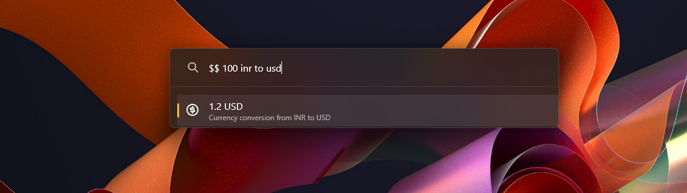
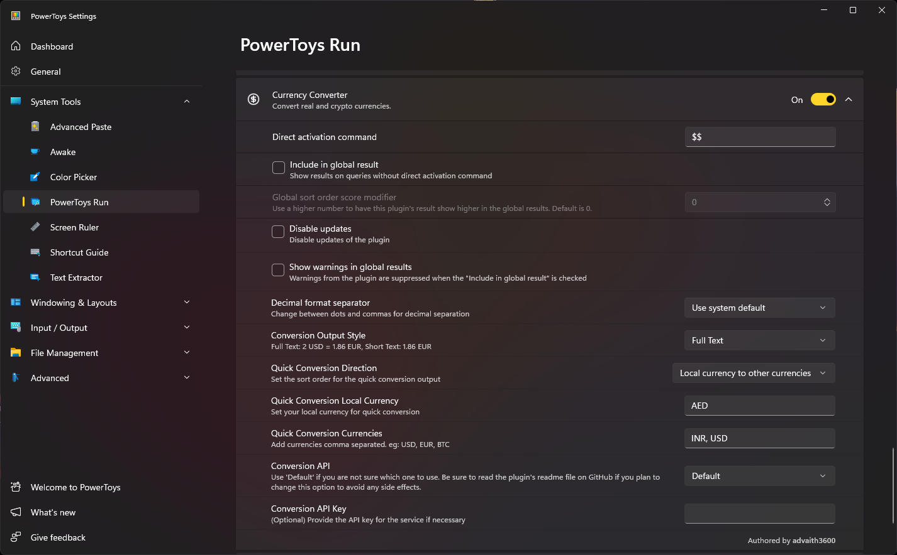
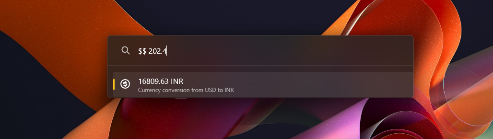
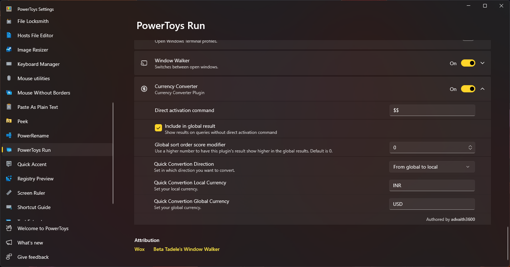
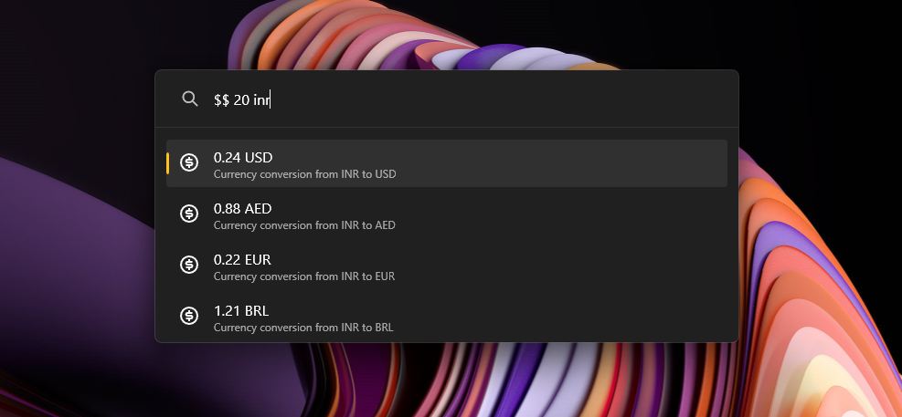
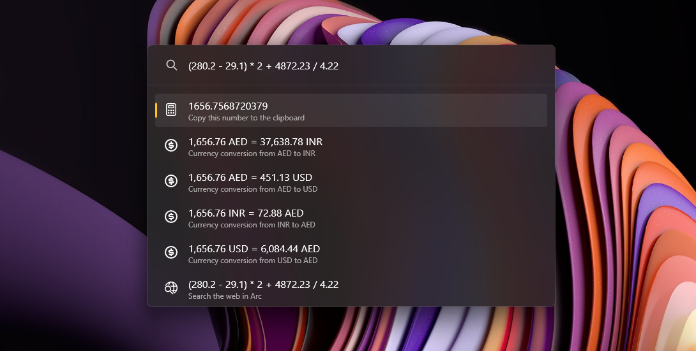

# Currency Converter

PowerToys Run plugin which will convert real and crypto currencies.



## Usage

```
$$ 100 inr to usd
```

### Changing / Removing prefix

You can change the `$$` prefix from the settings page. To use this plugin without any prefix just check the "Include in global result" checkbox. With that option checked, you can use this plugin without any prefix like 

```
1 eur to usd
```



### Aliasing

To make currency conversions more convenient, you can use aliasing to assign custom names to currencies. For example, you can alias "dollar" to "usd". 

To set up aliasing, follow these steps:

1. Locate the configuration file `alias.json` in `Documents/PowerToys/CurrencyConverter`.
2. Open the `alias.json` file in a text editor.
3. Add an entry for each alias you want to create. Each entry should have the format `"alias": "currency_code"`. For example, to alias "dollar" to "usd", add the following entry: `"dollar": "usd"`.
4. Save the `alias.json` file.

Please note that when creating aliases, ensure that the alias key does **not** contain any numbers or spaces and is in lowercase.

Once you have set up the aliases, you can use them in your currency conversions. For example, instead of typing `$$ 100 usd to eur`, you can simply type `$$ 100 dollar to eur`.

### Crypto and other currencies

This plugin also converters real currencies to crypto currencies and vice versa. Refer [here](https://cdn.jsdelivr.net/gh/fawazahmed0/currency-api@1/latest/currencies.json) for the full list of available conversions. 

Example Usage:

```
$$ 1 btc to usd
```



### Quick Conversions

You can swiftly convert from your local currency to another currency simply by typing the number. The settings allow you to change both the local and all other currencies.

```
$$ 102.2
```



### Output formatting and precision

The plugin supports two modes of output:

1. Short Text: The output will only contain the target currency.
2. Full Text: The output will contain both the source and target currencies.

You can adjust the precision value in the settings. This will determine the number of decimal points to be displayed. The plugin outputs values using dynamic precision. This means that if a value is less than 1, the number of non-zero decimals displayed will be exactly as specified in the settings.



### Mathematical Calculations

You can input mathematical expressions, and the plugin will evaluate them using the BODMAS rule. The permitted operations are `+` (addition), `-` (subtraction), `*` (multiplication), and `/` (division). The use of brackets is also supported.



## Installation

1. Download the latest release of the Currency Converter from the [releases page](https://github.com/advaith3600/powertoys-run-currency-converter/releases).
2. Extract the zip file's contents to your PowerToys modules directory (usually `%LOCALAPPDATA%\Microsoft\PowerToys\PowerToys Run\Plugins`).
3. Restart PowerToys.

## Conversion API

This plugin internally uses [Currency API](https://github.com/fawazahmed0/exchange-api) for the latest conversion rates. 
