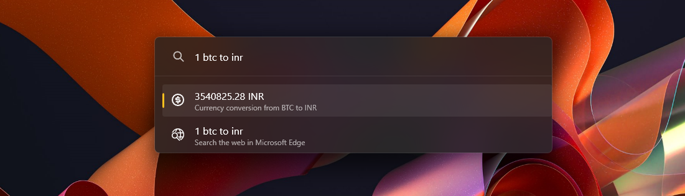

# Currency Converter

This is a plugin developed for PowerToys Run to convert currencies.


## Usage

```
$$ 100 inr to usd
```

### Changing / Removing prefix

You can change the `$$` prefix from the settings page. To use this plugin without any prefix just check the "Include in global result" checkbox. With that option checked, you can use this plugin without any prefix like 

```
1 eur to usd
```


### Crypto and other currencies

This plugin also converters real currencies to crypto currencies and vice versa. Refer [here](https://cdn.jsdelivr.net/gh/fawazahmed0/currency-api@1/latest/currencies.json) for the full list of available conversions. 

Example Usage:

```
$$ 1 btc to usd
```


### Quick Conversions

You can quickly convert from your local currency to a global currency by just typing the number.

```
$$ 102.2
```



Or, you can convert any currency to your local and global by:

```
$$ 1 eur
```


Your local currency, global currency and the quick conversion direction can also be changed from the settings page in PowerToys Run under this plugin. 

## Installation

1. Download the latest release of the Currency Converter from the [releases page](https://github.com/advaith3600/powertoys-run-currency-converter/releases).
2. Extract the zip file's contents to your PowerToys modules directory (usually `%LOCALAPPDATA%\Microsoft\PowerToys\PowerToys Run\Plugins`).
3. Restart PowerToys.

## Conversion API

This plugin internally uses [Currency API](https://github.com/fawazahmed0/currency-api) for the latest conversion rates. 
